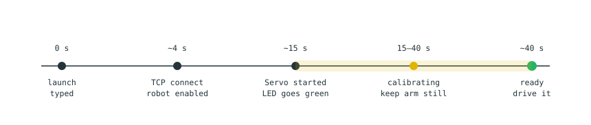

# 3. Running and stopping the program

[← Unpacking](02-setup.md) · [Contents](README.md) · [Next: Joystick controls →](04-joystick.md)

Everything runs from one terminal. **There is no timer and no auto-shutdown** —
it runs until you stop it.

---

## Starting

```bash
# 1. bring up the wired link (needed after every laptop reboot)
nmcli con up dobot-e6
ping -c3 192.168.5.1          # must reply before going further

# 2. enter the workspace and load the environment
cd "/home/yz22/Documents/code/Dobot arm"
source setup_dobot.bash

# 3. launch
ros2 launch dobot_e6_hw real_hw.launch.py robot_ip:=192.168.5.1
```

## What a good startup looks like



Watch for these four lines:

```
[dobot_tcp_node]:  RequestControl → 0,{},RequestControl();
[dobot_tcp_node]:  EnableRobot → 0,{},EnableRobot();
[activate_servo]:  Servo started — hold L1 and move the sticks to drive.
[haptic_feedback]: Calibration complete — peak_cond=16.5 LOWER=24.8 HARDSTOP=44.7
```

> **Keep the arm still for the first 40 seconds.** The 25-second calibration
> window measures how the arm behaves at rest to tune the rumble warning. Touch
> the controller during it and the warning will be mis-tuned — you will get
> buzzing at rest, or no warning when you need one.

`RequestControl()` is what claims TCP control of the arm. It runs at **every**
startup because the grant does not survive a power cycle. No DobotStudio Pro and
no Windows machine is needed.

## Stopping

Press **`Ctrl+C`** in the terminal running the launch and wait for the prompt to
come back. The software disables the arm on the way out, so the LED returns to
**steady blue**. That is the clean, finished state — there is nothing else to
shut down.

## Homing from the keyboard

Normally you home with the controller ([L1 + L2 + R2](04-joystick.md#homing)).
To do it from the keyboard — after an error, or before packing — **stop the
launch first**: the script needs the robot's command port, which the running
program holds open.

```bash
cd "/home/yz22/Documents/code/Dobot arm"
source setup_dobot.bash
python3 src/dobot_e6_hw/scripts/go_home.py

python3 src/dobot_e6_hw/scripts/go_home.py --speed 5   # slower, if the arm is awkward
```

It counts down from three before moving, prints joint angles as it goes, and
travels at about 5% of full speed. The click as it starts is the joint brakes
releasing — normal whenever a disabled arm is enabled.

## Health checks

Run these in a **second** terminal with the program still going:

```bash
source setup_dobot.bash
ros2 topic echo /servo_node/status      # 0 = no warnings
ros2 topic echo /joint_states --once    # do the angles match the real pose?
ping -c3 192.168.5.1                    # network alive?
ls /dev/input/js0                       # controller present?
```

---

[← Unpacking](02-setup.md) · [Contents](README.md) · [Next: Joystick controls →](04-joystick.md)
