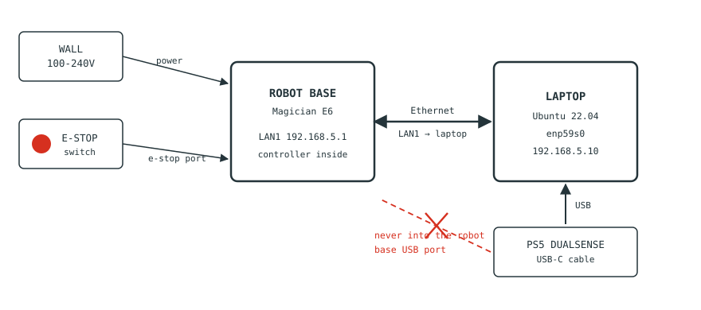

# 3. Unpacking, packing and connecting

[← Status lights](02-status-lights.md) · [Contents](README.md) · [Next: Running and stopping the program →](04-running.md)

The arm travels folded into a **packing posture**, and getting into and out of
that posture needs **DobotStudio Pro on the Windows laptop**. Do that first — the
Linux laptop is not involved until the arm is already unfolded.

---

## Three different poses — do not confuse them

| Pose | What it is | How you reach it |
|---|---|---|
| **Packing posture** | A compact fold that fits the foam in the box | DobotStudio Pro → **RunTo** |
| **Home pose** | The upright starting posture | DobotStudio Pro → **Home pose** |
| **Our teleop home** | `[0, −19.24, 117.25, −8.02, −90, 0]°`, flange parallel to the bench | Automatic — the controller combo, or `go_home.py` |

The first two are Dobot's own, reached only through their software. The third is
this project's, and is what the arm uses during a demonstration.

---

## The DobotStudio Pro procedure

**The same procedure both unfolds and folds the arm** — only the final button
differs. It runs on the **Windows laptop**, not the Linux one.

1. Connect the **Windows laptop** to the robot by Ethernet.
2. Open **DobotStudio Pro**.
3. Connect to the robot using **EtherCAT**.
4. **Enable** the robot.
5. Go to **Settings → Posture**.
6. **Set the speed below 40%.** Do this before moving anything — the arm folds
   through a large range and you want time to react.
7. Then, depending on what you are doing:

   | | Button | Action |
   |---|---|---|
   | **Unpacking** | **Home pose** | Click and **hold** until the arm arrives |
   | **Packing** | **RunTo** | Click and **hold** until the arm arrives |

8. **Disable** the robot.
9. Disconnect the Windows laptop and move the Ethernet cable to the **Linux
   laptop**.

> **The click-and-hold is a deadman.** The arm moves only while the button is
> held, and stops the moment you let go. If anything looks wrong, release.

> ⚠️ Keep a hand near the **emergency stop** throughout. The arm is bolted to the
> bench and the fold sweeps a wide path — check it will not drive into the
> benchtop, the phantom, or a cable.

---

## Unpacking

1. Open the box flat on the floor or a sturdy table. The arm weighs **7.2 kg**
   and is awkward — **use two people**.
2. Lift by the **base and upper arm together**, keeping the folded posture it was
   packed in. Do not lift it by the forearm or the wrist.
3. **Bolt the base down before doing anything else.** An unbolted arm will tip
   itself over the moment it moves.
4. Keep the box and foam — you need them to get home again.
5. Connect the cables (below) and power on.
6. Run the **DobotStudio Pro procedure** above, choosing **Home pose**.

> ⚠️ The arm reaches 450 mm in every direction from its base — front, back and
> sides — and can move its tool at 0.5 m/s. A 7.2 kg arm doing
> that on an unsecured base will walk off the bench. **Mount it before powering on.**

---

## The connections

| Order | Cable | From | To |
|---|---|---|---|
| 1 | Emergency stop | E-stop switch | **Robot base** e-stop port (usually pre-fitted) |
| 2 | Power | Robot base | Wall socket — leave switched off for now |
| 3 | Ethernet | Robot **LAN1** | Laptop wired port |
| 4 | USB-C | PS5 controller | **Laptop** |

> **The controller plugs into the laptop, never into the robot.** The USB socket
> on the robot base is for a WiFi dongle or file transfer only — a controller
> plugged in there does nothing.

LAN1 is the port fixed at `192.168.5.1`. LAN2 is a different subnet and will not
work. Connect everything **before** switching on at the wall.

Network configuration for the Linux laptop is in
[§4 Running and stopping](04-running.md).

---

## Powering the arm on

> ⚠️ **Tap it — do not hold it.**
> A short press **under 0.5 s** switches the arm **on**. **Holding for 1.5 s is
> the shut-down gesture.** If you press and hold you will see the light flash and
> then die when you let go — that is the robot booting and then being told to
> switch off. Every other button on the robot uses long-press to activate; the
> power button is the exception.

1. Check the e-stop is **not latched**. If pressed in, rotate to release.
2. Switch on at the wall.
3. **Quick tap** the power button on the base. Finger off immediately.
4. Watch the LED ring: blue fast flash (booting, 30–60 s) → **steady blue**.

**Steady blue is the ready state** — powered and healthy, waiting for the
program. [See §2 Status lights](02-status-lights.md).

---

## Packing down at the end

1. **Stop the program** with `Ctrl+C` on the Linux laptop. DobotStudio and this
   software cannot both control the arm.
2. Remove the probe and any tooling from the flange.
3. Move the Ethernet cable to the **Windows laptop**.
4. Run the **DobotStudio Pro procedure** above, choosing **RunTo**.
5. **Disable** the robot in DobotStudio.
6. Power off: **hold** the power button for 1.5 s until the light flashes red
   fast, then release.
7. Switch off at the wall and disconnect the cables.
8. Unbolt the base.
9. Lift with two people, keeping the folded posture, and lower it into the foam.

> ⚠️ **Do not transport it in any other pose.** The manufacturer requires the
> packing posture with working brakes before it goes in the box — the brakes are
> what hold the pose once power is off. Transporting it folded wrongly risks
> damaging the joints, and the foam will not support it.

---

---

[← Status lights](02-status-lights.md) · [Contents](README.md) · [Next: Running and stopping the program →](04-running.md)
