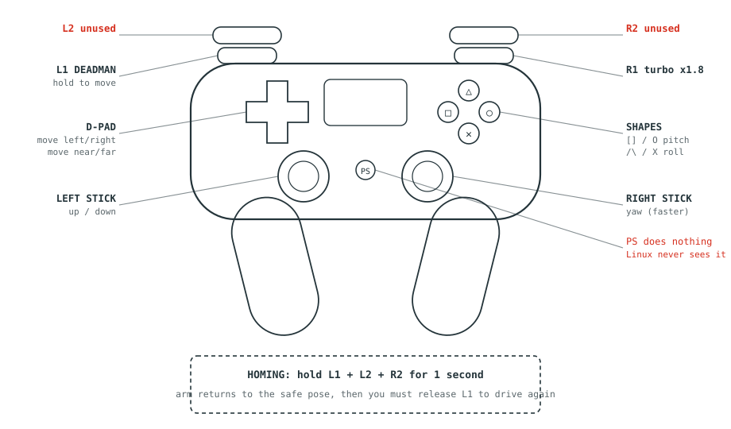
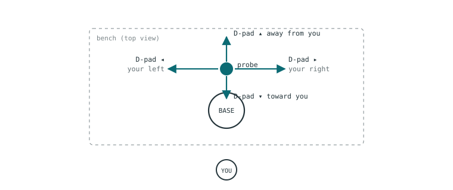

# 4. Joystick controls

[← Running](03-running.md) · [Contents](README.md) · [Next: Status lights →](05-status-lights.md)

**Hold L1 or nothing happens.** Every direction is described from the operator's
point of view, standing in front of the arm and facing it.

---

## What each control does

| Control | Motion | Rate | Feel |
|---|---|---|---|
| **L1** | **Deadman** — hold it or nothing moves | — | on / off |
| **D-pad ◄ ►** | Move to your **left / right** | 0.03 m/s | full rate or nothing |
| **D-pad ▲ ▼** | Move **away from / toward** you | 0.03 m/s | full rate or nothing |
| **Left stick ▲▼** | Move **up / down** | 0.03 m/s | proportional |
| **Right stick ▲▼** | **Yaw** — twist about vertical | 0.3 rad/s | proportional |
| **□ / ○** | **Pitch** — tilt the probe nose | 0.2 rad/s | full rate or nothing |
| **△ / ✕** | **Roll** — rotate about the probe axis | 0.2 rad/s | full rate or nothing |
| **R1** (with L1) | **Turbo** — *operator only, see [§1](01-safety.md)* | ×1.8 | hold |
| **L1 + L2 + R2** | **Home** — return to the safe pose | slow | hold 1 s |
| L2 or R2 alone | Nothing | — | — |
| PS button | Nothing — **not visible to the software** | — | — |

The PS button is unusable: the index exists in the controller's button array but
the press never reaches the software, because something upstream grabs it. It was
deliberately left unused.

## Directions are from where you stand

Stand **in front of the arm, facing it**. The D-pad then moves the probe the way
the arrow points, from your point of view — so your left is the robot's right.

> If you walk round to the side of the bench, the mapping no longer matches your
> body. Move back to the front before driving.

## Homing

Hold **L1 + L2 + R2 together for one second**. The arm pauses, moves gently to
the safe pose, and stops.

> **Afterwards, teleop stays disabled until you release L1 and press it again.**
> This is deliberate — it stops a stick you are still holding from flinging the
> arm the instant homing finishes. If the arm seems dead after homing, this is
> almost always why.

Homing moves joint by joint, so it works even from a pose that ordinary driving
cannot escape. But it takes the **direct route with no collision checking** —
clear the phantom out of the way and keep a hand near the e-stop.

## The rumble

The controller vibrates as the arm approaches a **kinematic singularity**.
Stronger buzz means closer. [See §7 →](07-limits.md)

> ⚠️ **The rumble is not contact force.** No force sensor is fitted. The vibration
> describes the arm's *geometry*, not how hard the probe is pressing. You will
> feel nothing when the probe touches down.

## Re-mapping

The mapping lives in `src/dobot_e6_bringup/config/joy_params.yaml`. Edit and
restart the program — no rebuild needed.

Every index in that file was **measured** on this specific controller, not
inferred from documentation. If you change controllers, measure again rather
than assuming: the kernel and the ROS driver disagree about D-pad sign, and an
earlier version of this project had a trigger mapped so that the arm climbed at
full speed the instant the deadman was pressed.

---

[← Running](03-running.md) · [Contents](README.md) · [Next: Status lights →](05-status-lights.md)
