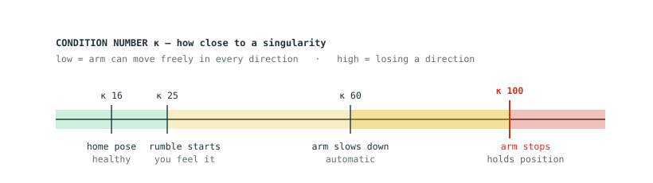

# 7. Joint limits and singularities

[← The probe: payload and contact force](06-scanning.md) · [Contents](README.md) · [Next: Troubleshooting →](08-troubleshooting.md)

What the arm does at its limits, and when a restart is actually needed.

---

## Short answer: it stays still

> ✅ The arm **stops moving and holds position**. It does not shut down, does not
> power off, does not drop, and does not raise an error. Motion simply stops being
> commanded. **No restart is needed** — drive back out the way you came.

## Singularities, and the three warnings you get

A singularity is a pose where the arm loses the ability to move in some
direction, typically when joints line up. Near one, small tool movements demand
enormous joint speeds, so the software intervenes early.

Closeness is measured by the **condition number (κ)**: low is healthy, high is
dangerous.

| κ | What happens |
|---|---|
| ~16 | The home pose. Healthy |
| ~25 | **Controller rumbles.** Re-measured at every launch during calibration, so the exact figure varies |
| 60 | **The arm automatically slows down** |
| 100 | **The arm stops** and holds position |

You get three escalating warnings before anything stops.

## Joint limits

The software stops commanding motion **0.1 radians (about 5.7°) before** a joint
reaches its limit, so the arm never runs into its own hard stops. You will also
feel rumble as a joint nears its limit.

| Joint | Travel | Joint | Travel |
|---|---|---|---|
| J1 base | ±360° | J4 wrist 1 | ±160° |
| J2 shoulder | ±135° | J5 wrist 2 | ±173° |
| J3 elbow | ±154° | J6 flange | ±360° |

## Getting out of it

1. **Release L1.**
2. Press it again and drive **in the opposite direction** to the one that got you
   stuck.
3. If that does not free it, hold **L1 + L2 + R2** for a second to home the arm.
   Homing moves joint by joint, so it works from poses that ordinary Cartesian
   driving cannot escape.

> ⚠️ Homing takes the **direct joint-space route with no collision checking**. From
> a twisted wrist that is harmless, but if the arm is somewhere awkward, watch the
> first second with a hand near the e-stop, and move the phantom clear first.

## When a restart *is* needed

| Situation | Restart? |
|---|---|
| Singularity reached, arm stopped | **No** — drive back out |
| Joint limit reached, arm stopped | **No** — drive back out |
| Rumbling constantly but the arm is fine | **No** — home it |
| Arm dead right after homing | **No** — release L1 and press it again |
| Emergency stop pressed | **Yes** — release it, then relaunch |
| Red light / alarm state | **Yes** |
| Arm ignores the controller entirely | **Yes** |
| Network dropped, ping fails | **Yes** — and re-run `nmcli con up dobot-e6` |

---

---

[← The probe: payload and contact force](06-scanning.md) · [Contents](README.md) · [Next: Troubleshooting →](08-troubleshooting.md)
