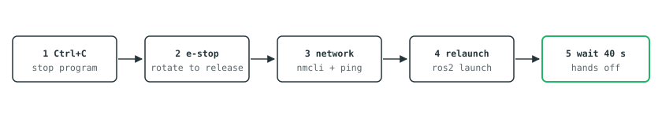

# 8. Troubleshooting

[← Limits](07-limits.md) · [Contents](README.md) · [Next: Packing down →](09-packing.md)

Work down the table. If nothing matches, do the full restart — it fixes almost
everything.

---

## Symptom table

| Symptom | Most likely cause | Fix |
|---|---|---|
| Arm does not move when L1 is held | You just homed it — teleop is deliberately disarmed | **Release L1 and press it again.** By design |
| Still does not move; LED green | Singularity or joint limit reached | Drive the other way, or home it. [§7](07-limits.md) |
| Every command rejected, `Control Mode Is Not Tcp` | DobotStudio is connected and holding the arm | Close DobotStudio completely, then restart. The software claims control automatically at startup |
| Launch hangs with no output | Wrong IP, robot off, or no network | `ping -c3 192.168.5.1`. If it fails, `nmcli con up dobot-e6` |
| Constant rumble, arm clearly fine and not moving | The arm is silently refusing commands, so the software's idea of its pose drifts | Look for `ServoJ rejected` in the terminal. Full restart |
| Red light | Alarm or collision detected | `Ctrl+C`, check the e-stop is released and nothing is jammed, relaunch. If it returns immediately, power-cycle the arm |
| Controller does nothing at all | USB not detected | Unplug and replug. Check `ls /dev/input/js0`. Restart the program |
| Rumbles at rest right after startup | The arm was moved during the 25 s calibration window | Restart and keep hands off for the first 40 s |
| Arm drifts with nobody touching anything | Stick drift on a worn controller | Release L1. Restart; if it persists the controller needs replacing |
| Collision alarms while scanning | Payload still declared as 0 kg | [See §6](06-scanning.md#software--tell-the-controller-about-the-load) |

## The full restart



```bash
# 1. Ctrl+C in the terminal running the launch
# 2. release the emergency stop if it is latched (rotate it)

nmcli con up dobot-e6
ping -c3 192.168.5.1

cd "/home/yz22/Documents/code/Dobot arm"
source setup_dobot.bash
ros2 launch dobot_e6_hw real_hw.launch.py robot_ip:=192.168.5.1

# 5. wait 40 s, hands off the controller
```

If a red light persists after a full restart, power-cycle the arm: **hold** the
power button 1.5 s to switch off, wait ten seconds, then **tap** once to switch
on.

## Health checks

```bash
source setup_dobot.bash
ros2 topic echo /servo_node/status      # 0 = no warnings
ros2 topic echo /joint_states --once    # angles match the real pose?
ping -c3 192.168.5.1                    # network alive?
ls /dev/input/js0                       # controller present?
```

## Reading the launch output

| Line | Means |
|---|---|
| `RequestControl → 0,{}` | TCP control claimed. Good |
| `EnableRobot → 0,{}` | Arm enabled. Good |
| `Servo started` | Ready to drive |
| `Calibration complete` | Rumble threshold tuned. Safe to touch the controller |
| `ServoJ rejected: ...` | **The arm is refusing motion.** Check mode and alarms |
| `RequestControl refused` | Something else holds the arm — close DobotStudio |
| `Robot PAUSEd` | Controller stuck in pause; the software sends `Stop()` to flush it |

---

[← Limits](07-limits.md) · [Contents](README.md) · [Next: Packing down →](09-packing.md)
